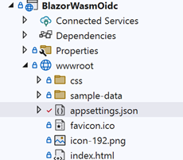

# [Auth0](https://auth0.com) (Okta)

## Introduction
Auth0 support:
- Traditional web app that runs on the server
- Web app that runs in the browser
- Mobile or desktop app that runs natively on a device
- An API or service protection

Rely on the Auth0 identity platform to add sophisticated authentication and authorization to your applications. Centralize and manage users from multiple identity providers and give them branded, seamless signup and login experiences. Finely control access with a degree of customization that can accommodate even the most complex security requirements.

For our sample you'll need an Auth0 account, and if you don't have it, you can get one for free [here](https://auth0.com/signup). Auth0 is for free with up to 7,000 active users and unlimited logins. No credit card required.
There some limitation for free acount (exclude trial period): No role management, 3 actions, 2 social logins, no account linking. 

## Get Started
After login you need to create [Single Page App](https://auth0.com/docs/quickstart/spa)
< NOTE: There is no Blazor yet, so choose any of the list. I chose Angular

Then go to to created application, copy `Domain` and `Client ID` and fill in Application URIs
- Allowed Callback URLs: https://localhost:7243, https://localhost:7243/authentication/login-callback
- Allowed Web Origins: https://localhost:7243

The next important step is to create a user (and role).

### Assing roles to claim
No roles will be visible by default. We need to add custom action to login flow


First, add an empty custom action and then replace it with the next code
```NODEJS
exports.onExecutePostLogin = async (event, api) => {
const namespace = 'https://my-samle.namespace.com';
  if (event.authorization) {
    api.idToken.setCustomClaim(`${namespace}/roles`, event.authorization.roles);
    api.accessToken.setCustomClaim(`${namespace}/roles`, event.authorization.roles);
  }  
};
```

>NOTE: you can use any possible domain name into namespace

## Settings for C#

We need to add the next section to appsettings.json  



```JSON
{
  "Auth0": {
    "Authority": "https://<your-part from domain>.us.auth0.com",
    "ClientId": "<Your client ID code>",

    "DefaultScopes": [
      "sub email"
    ],
    "ResponseType": "code"
  }

}
```
Where is you must replace `your-part from domain` with your server id, `Your client ID code` with your client ID. We add `sub` scope  for use user id `email` to get user email.

< NOTE: `openid` scope will be added automatically

Changes in program.cs
```C#
        builder.Services.AddOidcAuthentication(options =>
            {
                builder.Configuration.Bind("Auth0", options.ProviderOptions);
            });
```
## Run application

You can run application now and press login. You can see the next page with predefined login template.


And finally, our user claims:


< NOTE: you could find into Session Storage the next value under key `oidc.user`

```JSON
{
    "id_token": "eyJhbQ...",
    "token_type": "Bearer",
    "scope": "openid profile email",
    "profile": {
        "https://my-samle.namespace.com/roles": [
            "User"
        ],
        "nickname": "test",
        "name": "test",
        "picture": "https://s.gravatar.com/avatar/8d8baa54601248a51417004c791e0ffa?s=480&r=pg&d=https%3A%2F%2Fcdn.auth0.com%2Favatars%2Fte.png",
        "updated_at": "2022-xx-xxTxx:55:40.059Z",
        "email": "test@demo.com",
        "email_verified": false,
        "sub": "auth0|62cf23ffbf0c8b46ce5760c0"
    },
    "expires_at": 1657890365
}
```
> Storing tokens in browser local storage provides persistence across page refreshes and browser tabs, however if an attacker can achieve running JavaScript in the SPA using a cross-site scripting (XSS) attack, they can retrieve the tokens stored in local storage. A vulnerability leading to a successful XSS attack can be either in the SPA source code or in any third-party JavaScript code (such as bootstrap, jQuery, or Google Analytics) included in the SPA.