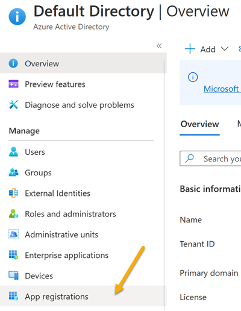
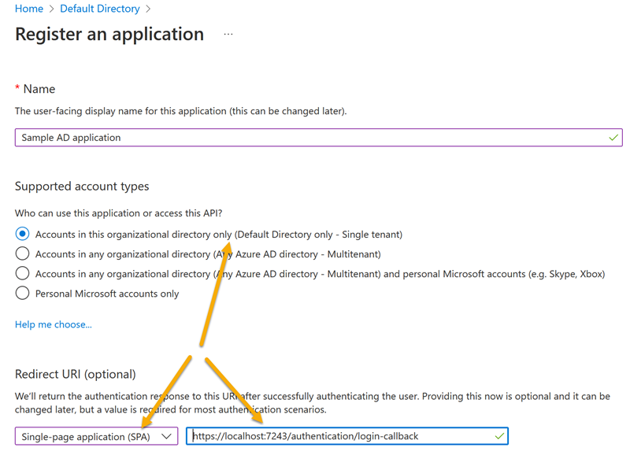
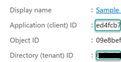
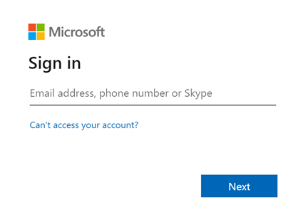
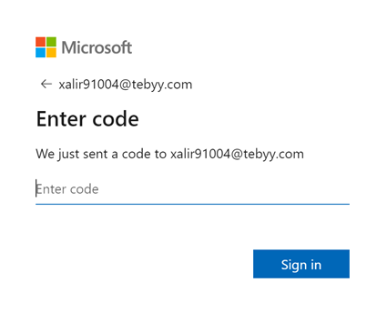
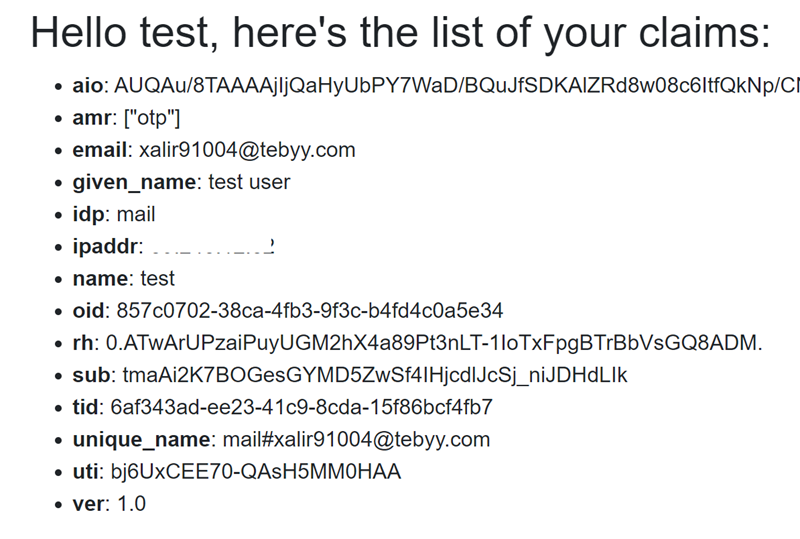

# Azure active directory

## Introduction
Azure Active Directory (Azure AD), part of Microsoft Entra, is an enterprise identity service that provides single sign-on, multifactor authentication, and conditional access to guard against 99.9 percent of cybersecurity attacks. 
Centrally manage all your identities and access to your applications, whether they're in the cloud or on premises, to improve visibility and control. Azure Active Directory is available in four editions—one free, one included with Microsoft 365 subscriptions, and two premium plans for advanced enterprise, threat protection, and governance needs. <sup>1</sup>

What is not written there thats Azure AD best suited for corporate users.
## Get Started

Get started with an Azure [free account](https://azure.microsoft.com/en-us/free). Then login to your subscription and search for `active directory` and select `App registration`



For our sample important to use the next settings



- Select: *Accounts in this organizational directory only (Default Directory only - Single tenant)*
- Select: *Single-page application*
- Type: https://localhost:7243/authentication/login-callback (possible, you need to replace `localhost` and port number for your application)

After Registration you need to copy `Tenant ID` and `Client ID`


> NOTE: I cut the numbers for security reason

You need to add test user. You can add external user with any email domain and internal user with domains which you "own" by azure portal. I added external user with temporary (fake) mail for test. You must have possibility to read Email as there will be send security code for login.

### Assing roles to claim
As written into <sup>3</sup> - This sample will not work with a **personal Microsoft account**

You can only assign roles with enterprise account.

> NOTE: pay attention that your registered application could be found under `Default Directory` and under `Enterprise application` path. In both cases it will be different menu items.

## Settings for C#
We need to add the next section to appsettings.json  


```JSON
{
  We need to add the next section to appsettings.json  


```JSON
{
  We need to add the next section to appsettings.json  


```JSON
{
  
  "AzureAd": {
    "Authority": "https://login.microsoftonline.com/<your tenant ID>",
    "ClientId": "<your clientID>",
    "ValidateAuthority": true
  }
}
```

Changes in program.cs
```C#
        builder.Services.AddOidcAuthentication(options =>
            {
                builder.Configuration.Bind("AzureAd", options.ProviderOptions);
            });
```
## Run application
You can run application now and press login. You can see the first login page



and type your mail address, then you must go to your mail software and wait account verification code, which you must enter there



And finally, our user claims:


## Links

1. [Azure Active Directory (Azure AD](https://azure.microsoft.com/en-us/services/active-directory/)
2. [How Application Provisioning works in Azure Active Directory](https://docs.microsoft.com/en-us/azure/active-directory/app-provisioning/how-provisioning-works )
3. [Add authorization using groups & group claims to an ASP.NET Core Web app that signs-in users with the Microsoft identity platform](https://github.com/Azure-Samples/active-directory-aspnetcore-webapp-openidconnect-v2/blob/master/5-WebApp-AuthZ/5-2-Groups/README.md)