# Keycloak

## Introduction
Keycloak is Open Source Identity and Access Management software. Keycloak is based on standard protocols and provides support for OpenID Connect, OAuth 2.0, and SAML Identity Providers. Easily enable social login.
From Keycloak version 17 the default distribution is now powered by Quarkus.
Unlike WildFly, Quarkus is not an application server. While an application server can dynamically deploy applications, and alter what is loaded into memory at runtime, this is not possible on Quarkus. The Bitnami Keycloak Quarkus container requires a PostgreSQL database to work.

## Installation
### Keycloak Wildfly
Using this container is easier because it uses the H2 database in memory that can be mapped to use physical storage. In addition in could be mapped to different databases:
- Postgres
- MySql
- MariaDB
- Oracle
- Microsoft SQL Server

For installation you will need the docker image<sup>3</sup>. Important by creation of container that you must set at least 2 variables:
- KEYCLOAK_USER
- KEYCLOAK_PASSWORD

Without it you cannot login to the administrator interface. Pay attention that these are credentials only for the first time.
After first login you can change it here:  
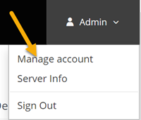 

You can map local directory to the `/opt/jboss/keycloak/standalone/data` if you want to have persistent settings.
If you use docker under unix don't forget about folder permissions. Pay attention that by default installation you can use HTTP protocol only. 
#### Create Realm

The next important step is to create a claim.   
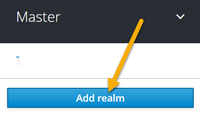 

Because keycloak can work with different clients, and each client can have its own URL or settings, we need to have a "storage room" for each client. This room is called a claim, and there is one default claim, the main claim. It is not recommended to use it for external calls. Each claim has his own users.

Interested settings for the future use are Login(2), Email(3) and Security Defences(4). Login page itself will be designed according to settings. 
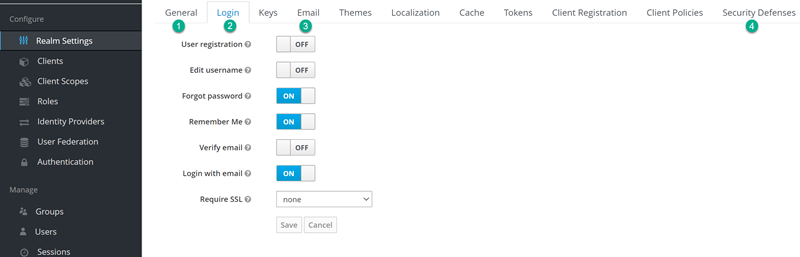 

> NOTE. Do not play with themes when using docker installing. When I started playing, I didn't have any themes on the pages after that.

On Email page it is possible to setup SMTP server for sending E-mails directly from keycloak. 
#### Create client

The next step is to create a client
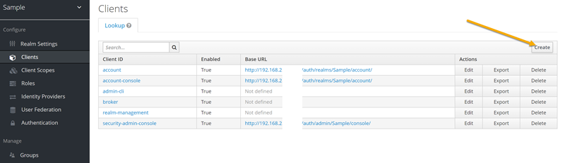

It is very important to fill in all the relevant URLs
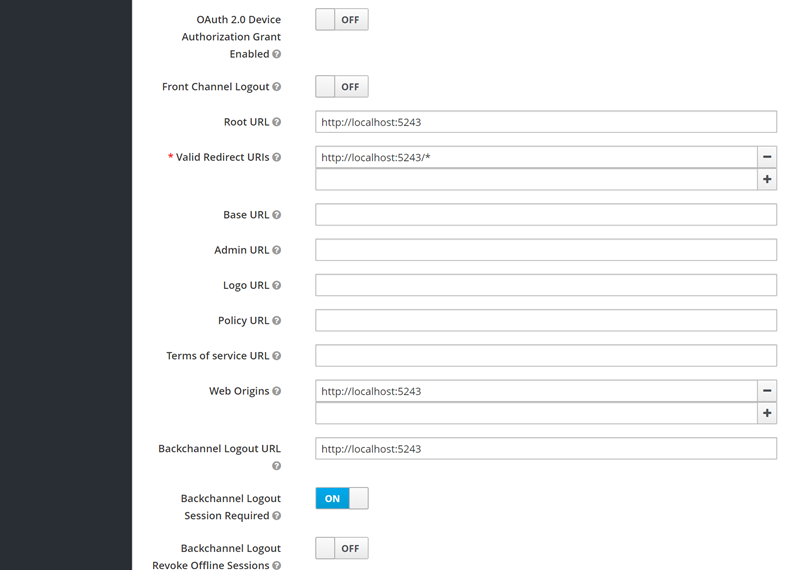 

> NOTE.  I will start my blazor application under `http://localhost:7243`

#### Create user 
The next step is to create a user
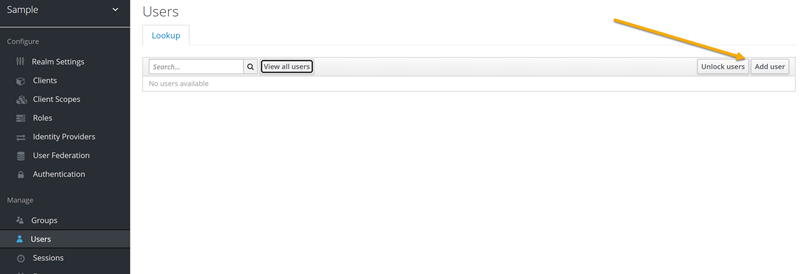
I set `Required User actions` to update profile. This means that after the first login, the user must fill out his profile.

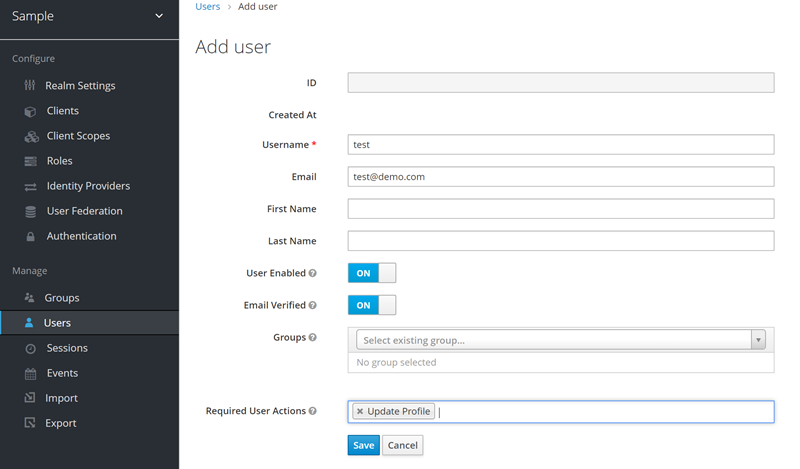

In addition, I set permanent user password. It is possible to set temporary user password, for the first login only. Then user must change this password later.
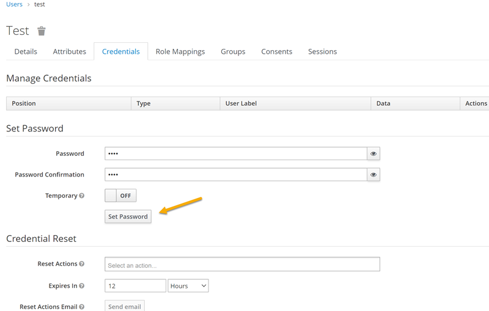
 
#### Create user role

The next step is optional, if you want to use user roles.
First we need to create a role itself.
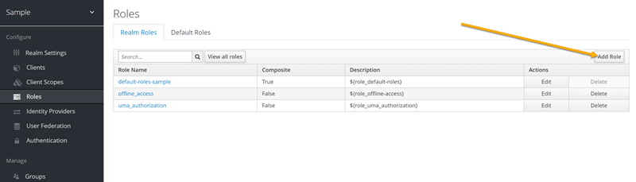

And then add role to the to our test user.  
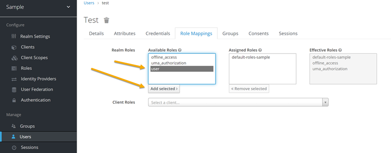
< NOTE. We can add role to default roles group if this role must have all users by default

If we want to have roles or some additional user information then we need to add client mapper for our client
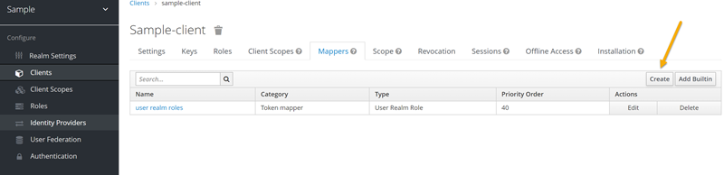 
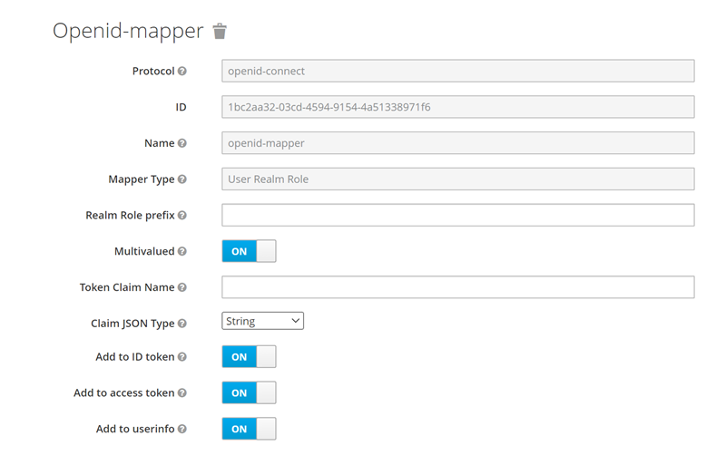 

#### Settings for C#

Since we use an HTTP server, we also need to use an HTTP client. Not recommended for production environment. 
Open Launch properties
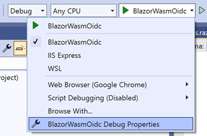
and remove https part from `App URL` 
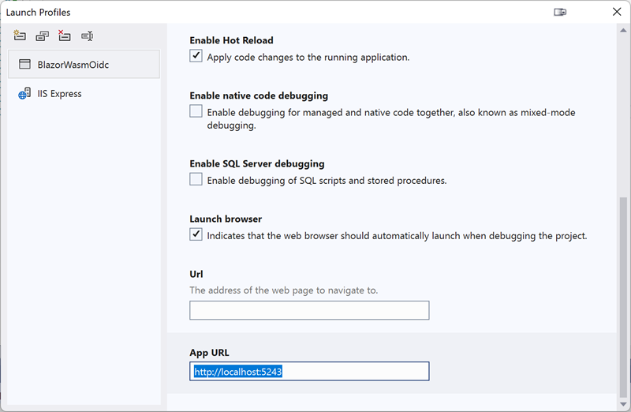 

Then we need to add the next section to appsettings.json

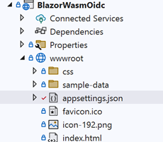

```JSON
{
  "Keycloak": {
    "Authority": "http://your-domain.com/auth/realms/Sample",
    "ClientId": "sample-client",

    "DefaultScopes": [
      "roles"
    ],
    "ResponseType": "code"
  }

}
```

Where is you must replace `your-domain.com` with your keykloak url, `Sample` with your realm name, `sample-client` with your client name. You can add any scope in addition to roles.
< NOTE: `openid` scope will be added automatically so we can use code flow only

#### Run application
You can run application now and press login. You can see the next page with predefined login template.
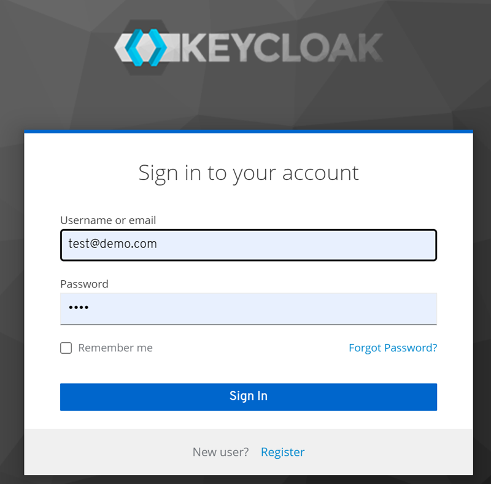

< NOTE: `Remember me` has sense for server only. For security reason it is not recomend to store any tokens client side.
< When you press refresh page button then you will need to login again but without typping your credential.
 
And finally, our user claims:
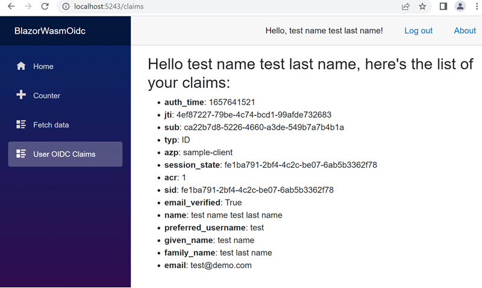

### Links
1. [Keycloak - main](https://www.keycloak.org/)
2. [Get started with Keycloak on Docker](https://www.keycloak.org/getting-started/getting-started-docker)
3. [Keycloak Server Docker image - jboss 16.1.1 (Legacy WildFly)](https://hub.docker.com/r/jboss/keycloak)
4. [Keycloak Server Docker image - Bithami 18.0.2 (Quarkus, need PostgreSQL database)](https://hub.docker.com/r/bitnami/keycloak/)
5. [Keycloak Admin REST API](https://www.keycloak.org/docs-api/18.0/rest-api/index.html)
6. [Migrating WildFly to Quarkus distribution](https://www.keycloak.org/migration/migrating-to-quarkus)
