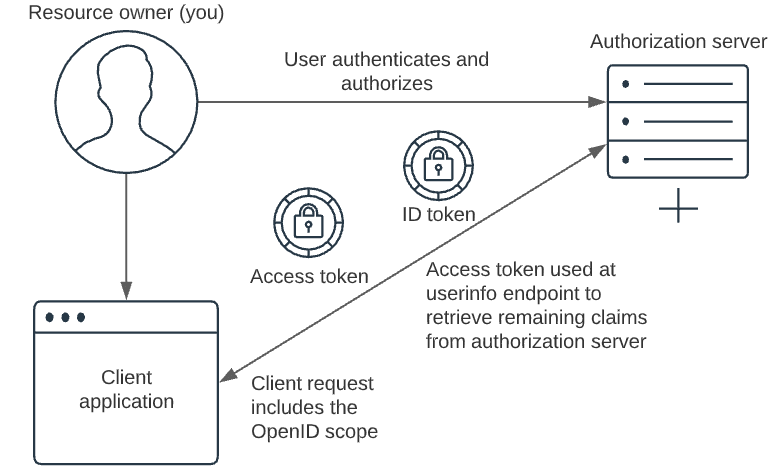

# Blazor web assembly standalone authentification

## Introduction
As long as you only want to use the client version, there is an immediate problem that you cannot use any personal/secret data in your application.
Any private data could be stolen on client side. But how we can manage web site users?
One variant is using external autorization server with OpenID Connection (OIDC).



*Image from pingidentity.com <sup>1</sup>*

OIDC is supported out of the box for Blazor standalone web assembly and .NET 6.0

## Sample application
We create Blazor web assembly standalone project with Visual studio 2022 and .NET 6.0
We try to add different authorization server to our applications. At the beginning, I describe keycloak only.

Important part for OIDC Authentication is the next lines:  
```C#
        builder.Services.AddOidcAuthentication(options =>
            {
                builder.Configuration.Bind("Keycloak", options.ProviderOptions);
            });
```
Where is the `Keycloak` is settings entry under wwwroot/appsettings.json
```JSON
{
  "Keycloak": {
    ...
  }

}
```

The exact settings depend on the authorization server used and are described in the corresponding section.  
> NOTE: Use branch correspoding to interested section. 
> branch `keycloak` for keycloak implementation,  
> branch `auth0` for auth0 implementation

## Authorization/Identity Server
 - [Keycloak](Docu/keycloak.md)
 - [Auth0](Docu/auth0.md)
 - [What is Azure AD Connect cloud sync](https://docs.microsoft.com/en-us/azure/active-directory/cloud-sync/what-is-cloud-sync "Azure AD Connect")
### Links

1. [OIDC: What Is OpenID Connect and How Does It Work? What You Need to Know](https://www.pingidentity.com/en/resources/content-library/articles/openid-connect.html)
2. [Secure an ASP.NET Core Blazor WebAssembly standalone app with the Authentication library](https://docs.microsoft.com/en-us/aspnet/core/blazor/security/webassembly/standalone-with-authentication-library?view=aspnetcore-7.0&tabs=visual-studio)
3. [OAuth 2.0 and OpenID Connect (OIDC) in the Microsoft identity platform](https://docs.microsoft.com/en-us/azure/active-directory/develop/active-directory-v2-protocols)
4. [Microsoft identity platform and OpenID Connect protocol](https://docs.microsoft.com/en-us/azure/active-directory/develop/v2-protocols-oidc)
5. [https://darutk.medium.com/diagrams-of-all-the-openid-connect-flows-6968e3990660](https://darutk.medium.com/diagrams-of-all-the-openid-connect-flows-6968e3990660 "Diagrams of All The OpenID Connect Flows")